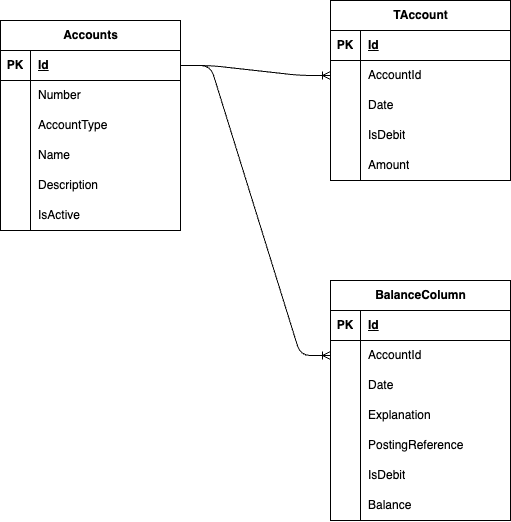

# CLI Accounting App

## Requirements

1. App shall display the following forms:
a. T-Account
b. Balance Column Account
c. Trial Balance
d. General Journal
e. Chart of Accounts
f. General Ledger
2. When closing accounts, temporary entries will be entered (pg. 58).

### Error Checking

1. [X] When a general ledger is produced, the number of credits and debits shall be checked to ensure they are equal.
2. [ ] A check shall be performed to provide awareness if an entry was made twice.
3. [ ] A check should be performed to ensure all entries are made.
4. [ ] A check should be performed to ensure all debits and credits were posted to the correct account.

### General Journaling

1. The app shall record a general journal.
2. At a minimum, a journal entry shall contrain the date, the debiting account, the crediting account, an explanation, a posting reference, the debit amount, and the credit amount.
3. When displaying a journal, the app shall display the term "General Journal" across the top center.
4. The general journal shall have the columns (in this order) *Date*, *Account and Explanation*, *P.R.*, *Debit*, and *Credit*.
5. The year and month shall only be displayed once in the *Date* column unless a new year or month occurs in the same general journal.
6. The *Accounts and Explanation* column shall record the titles of the ledge accounts (at least two) affected by each transaction.
7. Each account title is recorded on a separate line with the accounts debited entered first.
8. The title of the accounts credited shall be indented four four spaces to the right of the margin.
9. The explanation shall be written on the next line and shall be indented two spaces.
10. The journal shall be checked by adding all of the debits and all of the credits on the same page and verifing equivalence.
11. Check that each individual entry has equal credits and debits.
12. Journal totals are entered on the last line.
13. Entries must be in chornological order.
14. A Posting Reference shall reference the account the individual transaction occurred on.

### General Ledgers

1. The app shall display the general ledger for each account.
2. Posting References shall reference the page on the general journal the transaction happened.
3. An account's general ledger much include the Account Title, Acocunt Number, Date, Explanation, Posting Reference, Debit, Credit, and the Trial Balance.

### Trial Balance

1. The heading of the trial balance shall state the name of the business, the title of the statement, and the date of the statement.
2. The number and title of each account should be listed after the heading in the order in which they are found in the ledger.
3. The account balances should be listed in parallel columns &ndash; debit balances on the left and credit balances on the right.
4. Each column should be totaled, and these totals are entered at the bottom of the column; a single line should be drawn above each total, and a double line below each total.

### Displaying

1. The app shall display a balance column account form.
    a. The app shall be able to generate a balance column account form for each active account for a given period.
    b. At a minimum, the app shall include options for reporting in a given year, quarter, and month.
2. The app shall display a trial balance form.
3. The app shall display an income statement for a given time period.
4. The app shall display a balance sheet for a specific point in time.
5. The app shall display a statement of owner's equity for a given period of time.
    a. At a minimum, it shall include a year, quarter, and month periods.

### Chart of Accounts

1. The app shall display a chart of accounts.
2. The chart of accounts shall include the company name, title ("Chart of Accounts"), and for each active ledgar account, the account number and name of account.
3. Accounts shall be displayed from top to bottom in the order of assets, liability, owner equity, revenue, and expenses.
4. Accounts shall be further ordered alpha numerically.

### Earnings Statement

1. The app shall produce an earnings statement.
2. The earnings statement must state the period of time that it covers.
3. The earnings statement should have a heading consisting of:
a. Firm's name.
b. Statement title.
c. the time period covered by the statement.
4. Shows the total of individual expenses deducted from the total of the revenue sources.

### Statement of Financial Position (Balance Sheet)

1. Should have a heading consisting of:
a. Firm's name.
b. Name of the statement.
c. The date of the statement.
2. List all the asset accounts and their balances on the left side.
3. List all the liability and owner's equity acocunts and their balances on the right side.
4. Totals calculated on both sides to show equality.

### Petty Cash

1. Must be able to generate petty cash receipts. Receipts where something was purchased or transacted but no official receipt was given.
2. Error handling cash: when an error occurs while handling cash, a "Cash short and over" line should appear on the journal.
